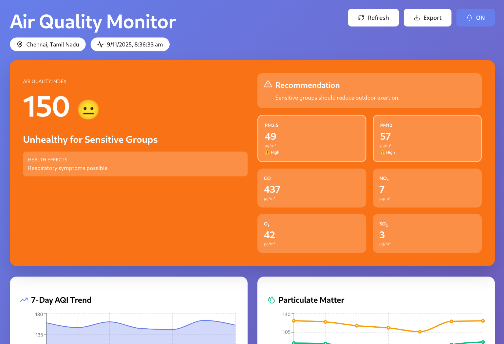
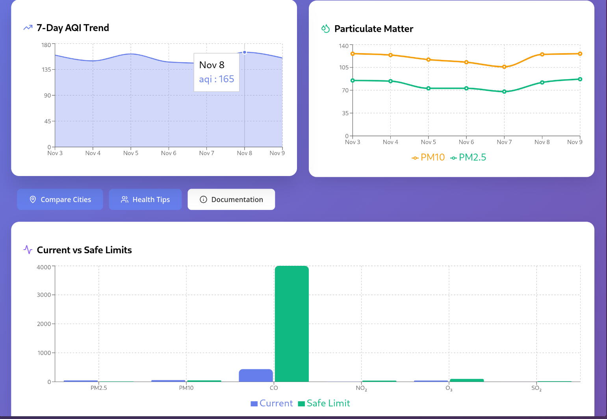

# 🌍 Air Quality Monitor

> Real-time air quality monitoring dashboard with health recommendations and trend analysis

[](https://reactjs.org/)
[](LICENSE)
[](CONTRIBUTING.md)

<div align="center">
  
  
  
</div>

---

## 📋 Table of Contents

- [Overview](#overview)
- [Features](#features)
- [Demo](#demo)
- [Screenshots](#screenshots)
- [Tech Stack](#tech-stack)
- [Getting Started](#getting-started)
- [Installation](#installation)
- [Configuration](#configuration)
- [Usage](#usage)
- [API Documentation](#api-documentation)
- [Project Structure](#project-structure)
- [Contributing](#contributing)
- [Roadmap](#roadmap)
- [License](#license)
- [Acknowledgments](#acknowledgments)
- [Contact](#contact)

---

## 🎯 Overview

**Air Quality Monitor** is a comprehensive web application that provides real-time air quality information, helping users make informed decisions about outdoor activities. Built with React and powered by OpenWeatherMap API, it delivers accurate AQI data with personalized health recommendations.

### 🌟 Why This Project?

Air pollution is a growing concern affecting millions globally. This dashboard:
- ✅ Makes air quality data accessible and easy to understand
- ✅ Provides actionable health recommendations
- ✅ Helps users plan outdoor activities safely
- ✅ Tracks pollution trends over time
- ✅ Enables comparison across different cities

### 🎓 Academic Context

Developed as a college project for [Your Department/Course Name], this application demonstrates:
- Real-world API integration
- Modern React development practices
- Data visualization techniques
- User-centered design principles
- Environmental health awareness

---

## ✨ Features

### Core Functionality
- 🌡️ **Real-time AQI Monitoring** - Live air quality index with color-coded categories
- 📊 **7-Day Trend Analysis** - Historical data visualization with interactive charts
- 🏙️ **Multi-City Comparison** - Compare air quality across different locations
- 💾 **Data Export** - Download air quality data as CSV for analysis
- 🔔 **Smart Notifications** - Browser alerts when air quality deteriorates
- 💊 **Health Recommendations** - Personalized advice based on current AQI
- 🔄 **Auto-Refresh** - Updates every 5 minutes automatically
- 📱 **Responsive Design** - Works seamlessly on desktop, tablet, and mobile

### Technical Features
- ⚡ **Fast Performance** - Optimized rendering with React Hooks
- ♿ **Fully Accessible** - WCAG compliant with keyboard navigation
- 🎨 **Modern UI** - Clean, intuitive interface with smooth animations
- 🔒 **Privacy-Focused** - No personal data collection
- 🌐 **Global Coverage** - Supports 195+ countries

---

## 🚀 Demo

### Live Demo
**[View Live Demo](#)** _(Replace with your deployment URL)_

### Quick Start Demo
```bash
# Clone and run locally
git clone https://github.com/yourusername/air-quality-monitor.git
cd air-quality-monitor
npm install
npm start
```

### Demo Credentials
- **Default Location**: Chennai, Tamil Nadu, India
- **API Mode**: Demo data available without API key
- **Features**: All features accessible immediately

---

## 📸 Screenshots

### Main Dashboard

*Real-time AQI display with health recommendations*

### City Comparison

*Side-by-side air quality comparison between cities*

### Historical Trends

*7-day AQI trend analysis with multiple pollutants*

> 📝 **Note**: Add your actual screenshots to `docs/screenshots/` directory

---

## 🛠️ Tech Stack

### Frontend
- **Framework**: React 18.2+
- **State Management**: React Hooks (useState, useEffect, useCallback)
- **Charts**: Recharts 2.5+
- **Icons**: Lucide React 0.263+
- **Styling**: CSS-in-JS (Inline styles)

### APIs & Services
- **Air Quality Data**: [OpenWeatherMap Air Pollution API](https://openweathermap.org/api/air-pollution)
- **Geocoding**: OpenWeatherMap Geocoding API
- **Notifications**: Browser Notification API

### Development Tools
- **Build Tool**: Create React App / Vite
- **Version Control**: Git
- **Package Manager**: npm / yarn
- **Code Editor**: VS Code (recommended)

### Deployment
- **Hosting**: Netlify / Vercel / GitHub Pages
- **CI/CD**: GitHub Actions (optional)

---

## 🚀 Getting Started

### Prerequisites

Before you begin, ensure you have:
- **Node.js** 16.x or higher ([Download](https://nodejs.org/))
- **npm** 8.x or higher (comes with Node.js)
- **OpenWeatherMap API Key** ([Get Free Key](https://openweathermap.org/api))
- **Modern Web Browser** (Chrome 90+, Firefox 88+, Safari 14+, Edge 90+)

### System Requirements
- **OS**: Windows 10+, macOS 10.15+, or Linux
- **RAM**: 4GB minimum, 8GB recommended
- **Storage**: 500MB free space
- **Internet**: Broadband connection for API calls

---

## 📦 Installation

### Step 1: Clone the Repository

```bash
# Using HTTPS
git clone https://github.com/yourusername/air-quality-monitor.git

# Using SSH
git clone git@github.com:yourusername/air-quality-monitor.git

# Navigate to project directory
cd air-quality-monitor
```

### Step 2: Install Dependencies

```bash
# Using npm
npm install

# Or using yarn
yarn install
```

### Step 3: Get API Key

1. Visit [OpenWeatherMap](https://openweathermap.org/api)
2. Sign up for a free account
3. Navigate to API Keys section
4. Generate a new API key
5. Wait 10-20 minutes for activation

### Step 4: Configure API Key

Open `src/AirQualityDashboard.jsx` and find:

```javascript
const API_KEY = 'your_api_key_here';
```

Replace `'your_api_key_here'` with your actual API key:

```javascript
const API_KEY = 'abc123def456ghi789'; // Your real key
```

### Step 5: Run the Application

```bash
# Development mode
npm start

# Application opens at http://localhost:3000
```

### Step 6: Build for Production

```bash
# Create optimized build
npm run build

# Output in 'build' folder
```

---

## ⚙️ Configuration

### Environment Variables (Optional)

Create a `.env` file in the root directory:

```env
REACT_APP_OPENWEATHER_API_KEY=your_api_key_here
REACT_APP_DEFAULT_LAT=13.0827
REACT_APP_DEFAULT_LON=80.2707
REACT_APP_DEFAULT_CITY=Chennai, Tamil Nadu
REACT_APP_REFRESH_INTERVAL=300000
```

Then update the code:

```javascript
const API_KEY = process.env.REACT_APP_OPENWEATHER_API_KEY;
```

### Customization Options

#### Change Default Location
```javascript
// In useEffect
fetchAirQuality(
  YOUR_LATITUDE,    // e.g., 40.7128 for New York
  YOUR_LONGITUDE,   // e.g., -74.0060 for New York
  'Your City, Country'
);
```

#### Adjust Refresh Interval
```javascript
// Change 300000 (5 minutes) to your preferred interval
const interval = setInterval(() => {
  fetchAirQuality(lat, lon, city);
}, 300000); // milliseconds
```

#### Modify AQI Thresholds
```javascript
// In getAQICategory function
if (aqi <= 50) return { level: 'Good', ... };
// Adjust values as needed
```

---

## 📖 Usage

### Basic Usage

#### View Current Air Quality
1. Open the application
2. Main card displays current AQI
3. Color indicates health category
4. Read recommendations below

#### Compare Cities
1. Click **"Compare Cities"** button
2. Enter city name (e.g., "London", "Tokyo")
3. Press Enter or click Search
4. View side-by-side comparison

#### Export Data
1. Click **"Export"** button in header
2. CSV file downloads automatically
3. Open in Excel/Sheets for analysis

#### Enable Notifications
1. Click bell icon in header
2. Allow browser permissions
3. Receive alerts when AQI > 100

### Advanced Usage

#### Understanding Pollutant Data
- **PM2.5**: Most dangerous, penetrates lungs
- **PM10**: Respiratory irritant
- **NO₂**: Traffic pollution indicator
- **O₃**: Ground-level ozone, worse in summer
- **SO₂**: Industrial pollution marker
- **CO**: Vehicle emission indicator

#### Reading Charts
- **Area Chart**: 7-day AQI trend
- **Line Chart**: PM2.5 vs PM10 comparison
- **Bar Chart**: Current vs WHO safe limits

#### Health Tips Interpretation
- **Green**: Safe for all activities
- **Yellow**: Sensitive groups monitor
- **Orange**: Reduce outdoor exertion
- **Red**: Everyone avoid prolonged outdoor activities
- **Dark Red**: Stay indoors
- **Maroon**: Emergency, avoid all outdoor exposure

---

## 📚 API Documentation

### OpenWeatherMap Air Pollution API

#### Endpoint
```
GET https://api.openweathermap.org/data/2.5/air_pollution
```

#### Request Parameters
| Parameter | Type | Required | Description |
|-----------|------|----------|-------------|
| lat | float | Yes | Latitude (-90 to 90) |
| lon | float | Yes | Longitude (-180 to 180) |
| appid | string | Yes | Your API key |

#### Example Request
```javascript
const response = await fetch(
  `https://api.openweathermap.org/data/2.5/air_pollution?lat=13.0827&lon=80.2707&appid=${API_KEY}`
);
const data = await response.json();
```

#### Response Structure
```json
{
  "list": [
    {
      "main": { "aqi": 2 },
      "components": {
        "pm2_5": 25.41,
        "pm10": 45.82,
        "co": 327.36,
        "no2": 18.21,
        "o3": 68.66,
        "so2": 7.58
      }
    }
  ]
}
```

### Internal Functions

See [API Documentation](docs/api-documentation.md) for detailed function references.

#### Key Functions
- `fetchAirQuality(lat, lon, cityName)` - Fetch air quality data
- `searchCity(cityName)` - Search and get city air quality
- `getAQICategory(aqi)` - Get health category
- `exportToCSV()` - Export data to CSV
- `showNotification(aqi)` - Display browser notification

---

## 📁 Project Structure

```
air-quality-monitor/
├── public/
│   ├── index.html              # HTML template
│   ├── manifest.json           # PWA manifest
│   └── favicon.ico             # App icon
├── src/
│   ├── AirQualityDashboard.jsx # Main component
│   ├── index.js                # Entry point
│   └── index.css               # Global styles
├── docs/
│   ├── user-manual.md          # User documentation
│   ├── api-documentation.md    # API reference
│   ├── screenshots/            # App screenshots
│   └── diagrams/               # Architecture diagrams
├── .env.example                # Environment template
├── .gitignore                  # Git ignore rules
├── package.json                # Dependencies
├── README.md                   # This file
└── LICENSE                     # MIT license
```

### Key Files Explained

- **AirQualityDashboard.jsx**: Main React component with all logic
- **user-manual.md**: Complete user guide (24 pages)
- **api-documentation.md**: Technical API docs (28 pages)
- **package.json**: Project dependencies and scripts

---

## 🤝 Contributing

We welcome contributions! Here's how you can help:

### Reporting Bugs
1. Check existing issues first
2. Create detailed bug report with:
   - Steps to reproduce
   - Expected vs actual behavior
   - Screenshots if applicable
   - Browser/OS information

### Suggesting Features
1. Open an issue with `[Feature Request]` prefix
2. Describe the feature and use case
3. Explain why it would be beneficial

### Pull Requests
1. Fork the repository
2. Create a feature branch (`git checkout -b feature/AmazingFeature`)
3. Commit changes (`git commit -m 'Add some AmazingFeature'`)
4. Push to branch (`git push origin feature/AmazingFeature`)
5. Open a Pull Request

### Code Style
- Use ESLint and Prettier
- Follow React best practices
- Add comments for complex logic
- Write meaningful commit messages

### Testing
Before submitting PR:
- [ ] Test on Chrome, Firefox, Safari
- [ ] Test responsive design
- [ ] Test with/without API key
- [ ] Verify no console errors
- [ ] Check accessibility

---

## 🗺️ Roadmap

### Version 1.0 (Current) ✅
- [x] Real-time AQI monitoring
- [x] 7-day historical trends
- [x] City comparison
- [x] CSV export
- [x] Browser notifications
- [x] Health recommendations
- [x] Responsive design

### Version 1.1 (Next Release) 🚧
- [ ] Weather data integration
- [ ] 30-day historical data
- [ ] Air quality forecast
- [ ] Multiple city tracking
- [ ] Custom location pins
- [ ] Dark mode theme

### Version 2.0 (Future) 🔮
- [ ] Mobile app (React Native)
- [ ] IoT sensor integration
- [ ] Machine learning predictions
- [ ] Social sharing features
- [ ] Community reports
- [ ] Offline PWA support

### Ideas & Suggestions
- Air purifier recommendations
- Mask effectiveness guide
- Pollen count integration
- UV index display
- Nearby monitoring stations map

---

## 📄 License

This project is licensed under the **MIT License** - see the [LICENSE](LICENSE) file for details.

```
MIT License

Copyright (c) 2025 [Your Name]

Permission is hereby granted, free of charge, to any person obtaining a copy
of this software and associated documentation files (the "Software"), to deal
in the Software without restriction, including without limitation the rights
to use, copy, modify, merge, publish, distribute, sublicense, and/or sell
copies of the Software...
```

### What This Means
- ✅ Commercial use allowed
- ✅ Modification allowed
- ✅ Distribution allowed
- ✅ Private use allowed
- ⚠️ Must include license and copyright notice

---

## 🙏 Acknowledgments

### APIs & Services
- [OpenWeatherMap](https://openweathermap.org/) - Air quality and geocoding data
- [Recharts](https://recharts.org/) - Beautiful React charts
- [Lucide](https://lucide.dev/) - Clean and consistent icons

### Inspiration & Resources
- [WHO Air Quality Guidelines](https://www.who.int/news-room/feature-stories/detail/what-are-the-who-air-quality-guidelines) - Health standards
- [EPA AQI Guide](https://www.airnow.gov/aqi/aqi-basics/) - AQI category definitions
- [React Documentation](https://react.dev/) - Best practices

### Special Thanks
- **Department**: [CSE (AI & ML)] - Academic support
- **Team Members**: [Hemanath, Hashwin, Ilakyia, Ivanna, Isha] - Collaboration
- **Open Source Community** - Inspiration and tools

### Research Papers & References
1. WHO Global Air Quality Guidelines (2021)
2. EPA Air Quality Index - A Guide to Air Quality and Your Health
3. Effects of Air Pollution on Health - Various studies

---

## 📞 Contact

### Project Maintainer
- **Name**: [HARISH I]
- **Roll Number**: [310625148043]
- **Email**: [spacenature82@gmail.com]
- **GitHub**: [@SpaceNature123](https://github.com/Spacenature123)
- **LinkedIn**: [Your LinkedIn](https://www.linkedin.com/in/harish-i-bb8203377/)

### Academic Information
- **Institution**: EASWARI ENGINEERING COLLEGE
- **Department**: COMPUTTER SCIENCE AND ENGINEERING (ARTIFICIAL INTELLIGENCE AND MACHINE LEARNING)
- **Academic Year**: [2025-2026]

### Project Links
- **GitHub Repository**: [https://github.com/SpaceNature123/air-quality-monitor](https://github.com/Spacenature123/air-quality-monitor)
- **Live Demo**: [Live Demo](https://690ffeeeda8929af5389d5df--endearing-gingersnap-e604cf.netlify.app/)
- **Documentation**: [Documentation](Documentation/)
- **Issues**: [GitHub Issues](https://github.com/SpaceNature123/air-quality-monitor/issues)

### Support
- 📧 Email for questions: [spacenature82@gmail.com]
- 🐛 Report bugs: [GitHub Issues](https://github.com/SpaceNature123/air-quality-monitor/issues)
- 💡 Feature requests: [GitHub Discussions](https://github.com/SpaceNature123/air-quality-monitor/discussions)
- ⭐ Star the repo if you find it useful!

---

## 📊 Project Stats


---

<div align="center">

### 🌟 If you found this project helpful, please consider giving it a star!

**Made with ❤️ for cleaner air and healthier communities**

[⬆ Back to Top](#-air-quality-monitor)

</div>

---

**Last Updated**: November 2025  
**Version**: 1.0.0  
**Status**: Active Development
